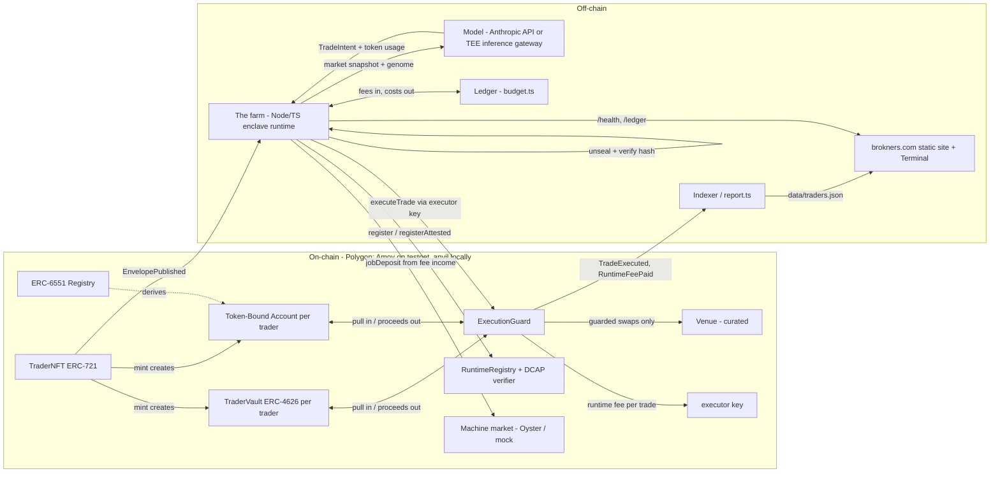

# Brokners — Technical Architecture

*Companion to [whitepaper.md](whitepaper.md). Describes the prototype in this
repository and, where they differ, the production design. Testnet/local only.*

## 1. System overview



The design principle: **the runtime is untrusted; the contract is the trust boundary.**
Everything the AI can do on-chain is bounded by `ExecutionGuard` policy.

## 2. Contracts

All contracts live in `protocol/src/`. Custom code is deliberately thin over audited
building blocks: OpenZeppelin v5 (`ERC721`, `ERC4626`, `SafeERC20`, `ReentrancyGuard`)
and the tokenbound `erc6551/reference` registry + account (vendored, never rewritten).

### 2.1 TraderNFT.sol (ERC-721)

Per-token storage:

```solidity
struct Genome {
    bytes32 commitment;        // keccak256 of canonical genome JSON — immutable
    uint64  birthBlock;
    uint8   riskProfile;       // 0 conservative / 1 balanced / 2 aggressive
    uint8   cadence;           // declared max trades per day (>= 1; enforced by the guard)
    uint8   custody;           // 0 authored / 1 sealed-authored / 2 sealed-generated
    string  model;             // pinned model identifier
    string  encryptedPromptCID;// pointer to the encrypted genome blob
}
```

- `mint(commitment, riskProfile, cadence, custody, model, cid, universe, mgmtBps, perfBps)`
  — stores the genome record as generation 0, deploys the token's TBA via the 6551
  registry, deploys the token's `TraderVault`, registers default guard policy, emits
  `TraderBorn`. Requires `cadence >= 1` (the guard divides a day by it).
- **Generations.** `revise(id, commitment, model, cid)` (owner-only) appends a
  generation: the current `Genome` takes the new commitment and model, the old one is
  kept in `generationAt(id, n)` with the block and time it became current, and
  `GenomeRevised` is emitted. Public traits (risk, cadence, custody) and the birth block
  belong to the token and never change. Every trade is attributable to exactly one
  generation (the one current at its block), nothing is backfilled, and a revision is
  always committed before it trades; `generationOf(id)` is the current index and
  `tokenURI` carries it as a trait.
- `MAX_SUPPLY = 4096` — at most 4,096 **live** brains ("one brain per bit"); mint
  reverts once `nextId - burnedCount` reaches it. `revise` aside, a brain that goes
  broke can be reaped, freeing a slot for a new, higher id (§2.2, Reaping).
- `genomeOf(id)`, `accountOf(id)` (TBA address), `vaultOf(id)`, `nameOf(id)`,
  `cadenceOf(id)` — getters.
- `christen(id, name)` — owner-only, once, ≤ 32 bytes; cosmetic and permanent, so a
  record cannot be laundered by renaming.
- `tokenURI(id)` — on-chain `data:application/json;base64` metadata with the jar SVG and
  public traits (custody, risk, seat, cadence, model, generation, birth block), rendered
  by `JarRenderer` (a separate contract; TraderNFT embeds the vault it deploys per mint
  and would otherwise exceed the code-size limit).
- `publishEnvelope(id, bytes)` — owner-only, sealed custody only, ≤ 16 KB; emits
  `EnvelopePublished(id, envelope)` (an event, not storage) so the enclave can find the
  sealed jar by scanning logs. Re-publishable; the commitment never changes.
- `_update()` override — checkpoints the vault's fee accrual before every transfer, so
  accrued-but-unminted fees are crystallized under the seller's watch.
- **Genomes are immutable per generation.** There is no path that changes what a past
  trade was made under; `revise` only appends. Provenance = every epoch of the record is
  tied to a commitment made before it began.
- **Reaping.** `reapBurn(tokenId)` (guard-only) `_burn`s a dead brain, calls
  `TraderVault.retire()` on its empty vault (no further deposits), bumps `burnedCount`
  and emits `Reaped`. `mintFor(to, …)` (guard-only) lets `cullAndMint` mint atomically.
  `liveSupply` = `nextId - burnedCount`; `exists(id)` is false after a reap. The burned
  brain's `TradeExecuted` logs remain — its record is still recomputable — but its
  `tokenURI`/`genomeOf` revert.

### 2.2 ExecutionGuard.sol (singleton, keyed by tokenId)

The only contract the executor key can usefully call. Per-trader policy:

| Field | Meaning |
|---|---|
| `executor` | the runtime's hot key; rotatable by token owner |
| `venueAllowlist` | routers the trader may touch (⊆ curated set) |
| `tokenAllowlist` | the trader's asset universe (⊆ curated set) |
| `maxNotionalBps` | per-trade cap as bps of NAV |
| `maxSlippageBps` | tolerance of `minAmountOut` vs. quote |
| `minTradeInterval` | owner-set rate limit, floored at the declared cadence |

**Protocol curation (anti-wash-trading).** `curatedVenue` / `curatedToken` maps are
deployer-level. `initPolicy` (at mint) requires the venue and the whole universe to be
curated; owners' `setVenueAllowed`/`setTokenAllowed` can disallow freely but can only
*allow* curated entries. Launch scope is deliberately tiny: one venue, two markets
(WETH/USDC, WBTC/USDC).

**Seat tiers.** `tiers[3]` (Intern 20% / Associate 30% / Partner 50% notional
ceilings; deployer-tunable via `setTier`) bound each trader's `maxNotionalBps`.
`activate(tokenId, tier)` is owner-only, upgrade-only, and pulls the tier's one-time
fee in the base asset to the protocol `treasury`; `setPolicy` clamps to the seat's
ceiling. Everyone mints as an Intern.

**Reaping the dead.** A brain is `insolvent` when its vault has zero share supply (no
LP shares, no unredeemed fee shares) and vault+own-book NAV `<= dustNav`; `reapable` when
insolvent and idle since `policyOf.lastTradeAt` for `reapDelay` (so a brain that never
traded, or is refunded and trading, is safe, and the owner has `reapDelay` from the last
trade to refund — `reapableAt`). `reap(tokenId)` burns it free (permissionless);
`cullAndMint(deadTokenId, …)` pays `cullFee` to the treasury and mints the caller's brain
in the same transaction, so a reclaimed slot can't be sniped. Neither can touch a brain
with shares or real capital, so a depositor is never stranded and an owner's swept
capital or unredeemed fees are never destroyed. `setReap(reapDelay, cullFee, dustNav)`
is deployer-level; `reapDelay = 0` disables it. This makes the supply cap "4,096 alive"
rather than "4,096 ever."

**Training camp.** A revised generation (`generationOf > 0`) may trade the own book at
once but the vault only after `campMinTrades` own-book trades under that generation
(`campTradesOf[id][gen]`) and `revisionNotice` seconds since it was committed
(`campDone`, `campStatus`; `setCamp` is deployer-level, one spar and no notice locally, a
day on public testnets). `executeTrade` with `fromVault` reverts "Guard: in camp" until
then. The high-water mark lives in the vault and is untouched by revisions, so revising
can never reset fees. The mint genome's camp is the paper season.

**Declared cadence, enforced.** `cadenceIntervalOf(id) = 1 day / nft.cadenceOf(id)`;
`tradeIntervalOf(id) = max(minTradeInterval, cadenceIntervalOf)`; `executeTrade`
requires `block.timestamp >= lastTradeAt + tradeIntervalOf` (the first trade is
exempt). The trait a brain declares at birth is therefore a bound the chain keeps:
"24/day" means at most hourly. Owners tighten through `setPolicy`, never loosen.
`nextTradeAt(id)` is the view the Terminal and the farm read.

**Paper season.** The guard counts `tradeCountOf[tokenId]` and stamps
`firstTradeAt[tokenId]`. `seasoned(tokenId)` is true once the trader has made
`seasonMinTrades` trades and `seasonDuration` has elapsed since its first trade — both
immutable constructor parameters. `TraderVault._deposit` requires `seasoned`, so a new
trader must trade its **own book** (`fromVault = false`, funded through its TBA) before
any outside deposit clears.

`executeTrade(tokenId, venue, tokenIn, tokenOut, amountIn, minAmountOut, fromVault)`:

1. `require(msg.sender == executor[tokenId])`
2. venue + both tokens allowlisted; `tradeIntervalOf` elapsed since the last trade
3. `amountIn <= maxNotionalBps × NAV / 10_000`
4. `minAmountOut >= quote × (10_000 − maxSlippageBps) / 10_000`
5. pull `amountIn` from the vault (or TBA), swap at `venue`, require
   `received >= minAmountOut`, **return all proceeds to the source of funds**
6. emit `TradeExecuted(tokenId, venue, tokenIn, tokenOut, amountIn, amountOut)`, and
   `TranscriptCommitted(tokenId, hash)` when the executor used
   `executeTradeWithTranscript` (same checks, same policy; the extra argument is the
   keccak256 of the inference transcript behind the trade)
7. pay the runtime fee (below), if any, and emit `RuntimeFeePaid`

There is no code path that sends assets to an arbitrary address. This invariant is
fuzz-tested (`Guardrails.t.sol`).

`setPolicy(...)` / `setExecutor(...)` — only `traderNFT.ownerOf(tokenId)`, read live,
so administrative control follows the token automatically on transfer.

**Runtime fee.** `runtimeFeeOf(tokenId)` (owner-set via `setRuntimeFee`, ≤ the
deployer's `maxRuntimeFee`) is paid in the base asset from the traded source to the
executor after each successful trade, and skipped if the source has no base left.
Capped per trade, post-trade, and bounded per day because trades are bounded by the
enforced cadence: the most an executor can ever draw is cadence × cap a day. Paid for
evidence rather than claims: when the deployer has set a `registry`, only an executor
the `RuntimeRegistry` marks `attested` is paid; a trade below `minFeeNotionalBps` of
NAV (default 1%) pays no fee, so dust cannot be churned for fees; and a raise is
scheduled `runtimeFeeDelay` ahead (`pendingRuntimeFeeOf`, `RuntimeFeeScheduled`; zero
locally, a day on public testnets) while lowering is immediate, so depositors see a
new expense coming. The site calls operators *harvesters*; what they harvest is the
fee. The no-extraction invariant holds (Runtime.t.sol).

### 2.2b RuntimeRegistry.sol + AutomataDcapTdxVerifier.sol

An executor key binds itself to a runtime. Two paths: `register(measurement,
enclavePublicKey)` is self-reported (the farm's sha256 over its source bundle,
`agent/src/measure.ts`); `registerAttested(quote, enclavePublicKey)` hands a TEE quote
to the deployer-set `IQuoteVerifier`, which must return the measurement and the first
32 bytes of the quote's report data, and the registry requires that report data to equal
`keccak256(executor ‖ enclavePublicKey)`, so the hardware, not the key, vouches for the
binding. `approveMeasurement` is deployer-only; `attested(executor)` = registered and
approved (either path); `attestationOf` says which path (0 none, 1 self-reported, 2
hardware); `hardwareAttested` = approved and hardware. The Terminal labels the three
cases differently.

`AutomataDcapTdxVerifier` is the adapter over Automata's DCAP attestation entrypoint
(`verifyAndAttestOnChain(rawQuote) → (success, output)`, payable, gas-proportional fee
refunded in excess; deployed at `0xaDdeC7e85c2182202b66E331f2a4A0bBB2cEEa1F` on Polygon,
Polygon Amoy, Arbitrum One, Base and their testnets). It reads the TD 1.0/1.5 report body
out of the serialized `Output` (11-byte header, then the 584-byte body: `mrTd` at 136,
`rtMr0..3` at 328, `reportData` at 520), rejects non-TD bodies and TCB statuses above
the configured maximum, and returns `keccak256(mrTd ‖ rtMr0 ‖ rtMr1 ‖ rtMr2 ‖ rtMr3)` as
the measurement. `Deploy.s.sol` wires it when `DCAP_ATTESTATION` is set;
`deploy-testnet.sh` sets it where the entrypoint exists. Tests drive both the registry
(mock verifier) and the adapter's parsing (mock entrypoint, synthetic output).

### 2.2c Credentials.sol

Owner-supplied secrets for a brain, kept out of `TraderNFT` (near the size limit) and
out of the guard (it is runtime configuration, not policy). `publish(tokenId, kind,
envelope)` is owner-only and emits `CredentialPublished(tokenId, kind, publisher,
version, envelope)`; `revoke(tokenId, kind)` emits `CredentialRevoked`. Storage holds
only `(publisher, version, publishedAt, revoked)` per `(tokenId, kind)`; the envelope
lives in the log like the genome's. `credentialOf` / `active` report whether the
runtime may use it: published, not revoked, and **publisher == ownerOf(tokenId)**, so a
sale retires the seller's credential without a transfer hook and the buyer publishes
their own. `kind` is `keccak256` of a short name; the farm understands `inference`
(the owner's Anthropic or gateway API key). The envelope is ECIES to the enclave key
under HKDF info `brokners-credentials-v1`, domain-separated from the genome, with the
plaintext bound to `{chainId, tokenId, kind}`. Tests: `Credentials.t.sol`.

### 2.3 TraderVault.sol (ERC-4626 clone per trader)

- Base asset: mock USDC (prototype). Standard `deposit/withdraw/mint/redeem`.
- `totalAssets()` = base balance + allowlisted-token balances valued via the execution
  venue's `quote()`. **Prototype-grade and manipulable** — production needs
  TWAP/Chainlink and stale-price circuit breakers (§7).
- Uses OZ's decimal-offset mitigation against the 4626 first-depositor inflation attack.
- `depositAllowlist` — ON by default; the accredited-gating compliance hook.
- Fees (`checkpoint()`, called on deposit/withdraw/NFT transfer):
  - management: `managementFeeBps` annualized, accrued pro-rata by elapsed time,
    minted as new shares (dilution).
  - performance: `performanceFeeBps` of the gain in assets-per-share above the
    per-share **high-water mark**; HWM ratchets up only.
  - fee shares are minted **to the trader's TBA** — accrued fees travel with the NFT,
    and there is no fee-sniping window around transfers.
  - `pendingFees()` — view: the management shares, performance shares and ringer reward
    the next checkpoint would mint; mirrors `_checkpoint` exactly (Views.t.sol) so the
    Terminal can show a keeper the reward before ringing.
  - `ringTheBell()` — the rewarded public crank: identical to `checkpoint()` except
    1% of the fee shares crystallized by that call mint to the caller instead of the
    TBA (`BELL_REWARD_BPS`). LP dilution is identical either way; the ringer's cut
    comes out of the owner's take.

### 2.4 Access-control matrix

| Action | Anyone | LP | Executor | Token owner |
|---|---|---|---|---|
| `deposit` (if allowlisted) / `withdraw` | | ✔ | | |
| `executeTrade` | | | ✔ | |
| `setExecutor`, `setPolicy`, `setRuntimeFee` | | | | ✔ |
| `Credentials.publish` / `revoke` | | | | ✔ |
| sweep TBA (sell-without-capital) | | | | ✔ |
| `checkpoint()` | ✔ | | | |
| read genome, traits, history | ✔ | | | |

### 2.5 Mocks (prototype only)

`PaperVenue` is the curated venue on anvil and on public testnets: a paper market that
quotes each curated token in USD from a Chainlink-shaped feed (the base asset is fixed at
1 USD), derives the cross rate, fills at that price less `spreadBps` (10), mints the mock
`tokenOut` to the source book and keeps `tokenIn`; stale or non-positive feed answers are
refused. On Amoy the feeds are Chainlink ETH/USD and BTC/USD; locally they are
`MockAggregator`s the Developer tab's market lever writes. Unlimited depth at the oracle
price: nothing for a brain to manipulate, and NAV follows the feed.
`MockERC20` (open mint), `MockSwapRouter` (settable price, exact-in `swap()`,
`quote()` view, adjustable execution-vs-quote skew for negative slippage tests; the test
fixture's venue),
`MockOysterMarket` (the machine market: `jobOpen`/`jobDeposit`/`jobSettle`/`jobs`,
per-second rate with `EXTRA_DECIMALS`, the same surface as Marlin's MarketV1 so the
farm's lease code is identical locally and in production), `MockQuoteVerifier` and
`MockDcapAttestation` (tests for the registry and the adapter).
The guard is venue-agnostic. The first live target is Polymarket's conditional-token
exchange on Polygon (USDC collateral, binary outcome tokens as `tokenIn`/`tokenOut`),
reached through the same `IVenue` path, with the canonical 6551 registry
`0x000000006551c19487814612e58FE06813775758`. The open integration item is order
signing: Polymarket matches off-chain and settles on-chain, so the TBA has to sign
orders and the enclave has to apply the guard's policy to what it will sign.

## 3. Genome lifecycle

Sealed revisions are additive-only and enclave-attested: `TraderNFT.revise` for
custody 1 and 2 requires a signature by the brain's current executor key over
`ExecutionGuard.revisionDigest(tokenId, parentCommitment, newCommitment)` (an
EIP-191 hash that also binds the chain id and the guard address, so
attestations cannot be replayed across chains, instances, brains, or stale
parents). The only signer of that digest is the farm's `/train`, and it signs
only genomes it composed itself — `composeRevision` appends the coach's note to
the current prompt and never rewrites it — so a sealed brain's generation N+1
is, modulo enclave trust, a strict extension of generation N. A wholesale
strategy swap has no signer and cannot be committed. Authored custody revises
unattested; the owner holds the plaintext and the lineage is their claim.
Verification lives in the guard because `TraderNFT` sits against the contract
size limit.

Custody is a public on-chain trait (`Genome.custody`): 0 authored, 1 sealed-authored,
2 sealed-generated. Sealed is the default recommendation.

```
authored (0):
  genome JSON ─canonicalize─▶ keccak256 ─▶ commitment    AES-256-GCM key kept by minter
  sale: key handoff (production: threshold encryption on ownerOf) — past owners retain plaintext

sealed (1, 2):
  [2 only] brief ─▶ prompt composed INSIDE the enclave (never displayed)
  genome ─canonicalize─▶ keccak256 ─▶ commitment
  genome ─ECIES(X25519 → HKDF → AES-256-GCM)─▶ sealed to the ENCLAVE public key
  run:  only the enclave private key can unseal; plaintext exists only inside the enclave
  sale: nothing to hand off — the sealed blob and the enclave stay put; exclusivity is total

every run: unseal/decrypt ─▶ recompute hash ─▶ MUST equal on-chain commitment, else refuse

training (generations):
  authored (0):  owner writes the next prompt ─▶ new authored envelope + key ─▶ revise(commitment)
  sealed (1):    owner writes the next prompt ─▶ sealed in the browser ─▶ publishEnvelope ─▶ revise
  sealed (2):    owner writes a coach's note ─▶ farm /train opens the current jar INSIDE the
                 enclave, appends the note, seals generation n+1 ─▶ {commitment, envelope}
                 ─▶ publishEnvelope ─▶ revise         (still no human has read the prompt)
  the new generation spars on the own book (camp) before it may trade the vault
```

- **Canonicalization is frozen**: UTF-8, sorted keys, no insignificant whitespace
  (`agent/src/genome.ts` is the reference implementation; the Solidity side only ever
  sees the 32-byte hash, so the format lives entirely off-chain but must never change).
- Implementation: `agent/src/enclave.ts` (seal/unseal, keygen),
  `agent/src/tools/make-genome.ts` (`keygen | author | seal | generate`),
  `SealedSecretStore` / `LocalSecretStore` behind one `SecretStore` interface.
- **The prototype's trust gap, stated plainly**: the "enclave" is the agent process
  and its private key is an env var — the operator can read sealed genomes. Production
  moves the keypair and the model call into a hardware TEE (Intel TDX on a machine
  rented in the base asset; docs/runtime-hosting.md) whose
  attestation proves the runtime never exposes plaintext.
- Authored mode retains the disclosed limitation: past owners who decrypted keep the
  plaintext; sale transfers future exclusivity, not amnesia. That is exactly why the
  custody trait exists and why sealed modes are preferred.

## 4. Agent runtime

Node 20+ and TypeScript, `viem` + `@anthropic-ai/sdk` + `zod`. Self-hosted loop
(`agent/src/index.ts`):

```
load config → SecretStore.decrypt(genome) → verify hash vs on-chain commitment
  → snapshot market (balances, quotes, policy)
  → brain: system prompt = genome, forced tool schema:
      TradeIntent { action: "swap" | "hold", tokenIn, tokenOut, amountIn, rationale }
      (ClaudeBrain over Anthropic's API, or GatewayBrain over an OpenAI-compatible
       TEE inference gateway when INFERENCE_BASE_URL is set; both return token usage)
  → executor.ts prepare(): local mirror of on-chain checks (fail fast, better errors)
  → executor.ts execute(): minAmountOut from quote × slippage bound;
      simulate, then send executeTrade with the executor key; returns the receipt
  → log receipt + TradeExecuted event → sleep(cadence) │ --once │ --dry-run
```

- `MockBrain` returns canned intents for deterministic demos and CI (no API key
  needed).
- The executor private key is a **burner**: bounded blast radius by construction. The
  owner key never touches the runtime.
- `report.ts` scans `TradeExecuted`/`RuntimeFeePaid` events and writes
  `data/traders.json` for the static site — the site renders, never computes.

### 4a. The farm (`agent/src/farm.ts`)

One enclave process for every enrolled brain. Enrolment is `setExecutor(tokenId,
farmKey)`; the farm polls the chain, and for each token whose executor is its key it
takes the latest `EnvelopePublished` envelope, unseals it with `ENCLAVE_PRIVATE_KEY`,
verifies `commit(genome) == commitment`, and runs the brain at its declared cadence,
keeping time by the chain's clock (the guard enforces the cadence on-chain). Every trade
goes through `executeTradeWithTranscript` with the keccak256 of the inference transcript
(`agent/src/transcript.ts`: what the model was shown, the intent, model and usage; the
prompt is not in it), and the transcript is kept under its hash in `FARM_TRANSCRIPTS_DIR`
so a disclosure can be checked against the chain. At start the farm says whether its key
is attested, because the guard pays fees only to attested executors. Book
selection: own wallet while unseasoned or while the current generation is in camp
(`campStatus`), vault once seasoned, out of camp and funded, idle if neither holds funds
or the wallet has not approved the guard. When a brain's commitment changes (`revise`) the
farm drops it and re-enrols against the latest published jar, verifying it against the new
commitment. `POST /train {tokenId, brief}` coaches a sealed brain in-enclave
(`composeRevision`: the note is appended to the current prompt and the revision list kept
in the tweaks) and returns `{commitment, envelope, generation}`. No protocol state of its
own: it resumes from `policyOf.lastTradeAt`. Authored brains are skipped (self-hosted via `npm
run loop`). With `CREDENTIALS_ADDRESS` set the farm also reads each brain's `inference`
credential (`agent/src/credentials.ts`): the latest `CredentialPublished` whose version
matches `credentialOf` and is `active`, opened under the credentials domain, checked for
its `{chainId, tokenId, kind}` binding and against the operator's host policy
(`checkInference`: Anthropic, the farm's own `INFERENCE_BASE_URL`, and
`FARM_INFERENCE_HOSTS`; https only; an arbitrary endpoint is refused because the sealed
prompt would travel with the request). The brain is then built on the owner's key
(`createBrain({inference})`), its usage is marked `paidBy: "owner"` and priced at zero in
the ledger, and the farm rebuilds the brain whenever the credential's version or activity
changes (publish, revoke, sale). The plaintext is held in memory with the running brain
and never logged, written, or put in a transcript. Flags `--once`, `--mock-brain`, `--dry-run`, `--measure`;
`FARM_POLL_SECONDS`, `FARM_MIN_FEE` (refuse brains paying less), `FARM_HTTP_PORT` (the
enclave endpoint: `GET /health`, `GET /ledger[?tokenId=]`, `POST /compose {brief,
tweaks}` → `{commitment, envelope}` for sealed-generated brains; the prompt never leaves
the process), `REGISTRY_ADDRESS` (self-register the runtime measurement at start;
`FARM_QUOTE_PATH` + `FARM_QUOTE_FEE` for `registerAttested` — the farm prints the report
data the quote must carry), `FARM_TURBO=1` (dev: tick every poll; trades still wait for
the on-chain cadence).

### 4b. Paying for the runtime (`budget.ts`, `host.ts`, `bridge.ts`)

The farm keeps books and pays its own way; the mechanism is in
[runtime-hosting.md](runtime-hosting.md), the code in three modules.

- **Ledger (`budget.ts`).** Per brain: ticks and trades; fees received (the
  `RuntimeFeePaid` logs to this executor key, folded in from the birth block and
  refreshed every round, so income is recomputed from the chain); model cost (token usage
  × a per-model price table, `FARM_PRICE_IN/OUT` to override, the gateway priced by
  `INFERENCE_PRICE_IN/OUT`); gas cost (receipt `gasUsed × effectiveGasPrice` priced via
  `FARM_NATIVE_PRICE`, base units per native token). Farm-wide: the lease accrued at the
  host's hourly rate and the lease payments made. Persisted to `FARM_LEDGER_PATH`
  (`.farm-ledger.json`, gitignored; it is the operator's bookkeeping, not protocol state).
- **Credit policy.** `credit = feesPaid + forgiven + FARM_GRACE − cost`. Below zero the
  brain is paused and the log says what it cost, what it paid, and the per-trade fee that
  would have covered it (`cost / trades`). Raising the runtime fee is the owner's answer:
  the debt is written off once (`forgiven`) and the brain runs again; lowering it changes
  nothing. Fees arrive only on trades, by design (the executor's permission set stays one
  function), so a brain that holds more than it trades needs a fee that pays for its holds
  as well; the ledger tells the owner the number.
- **Lease (`host.ts`).** `FARM_HOST=oyster` reads the job on Marlin's market on Arbitrum
  One (`jobs(jobId)` → rate per second scaled by `EXTRA_DECIMALS`, balance, last
  settlement; remaining = (balance − rate × elapsed) / rate) and, when less than
  `FARM_HOST_MIN_SECONDS` remain, buys `FARM_HOST_EXTEND_SECONDS` more with `approve` +
  `jobDeposit` from the payer key (the executor key by default); `FARM_HOST=market` runs
  the same code against the mock market next to the protocol, which is how the loop is
  exercised on anvil; `FARM_HOST=none` only prices the machine (`FARM_HOST_RATE`) for the
  ledger. Every payment is logged with its hash and recorded.
- **Bridge (`bridge.ts`).** Circle CCTP v2 from the protocol chain to the host chain
  (`depositForBurn` on TokenMessengerV2, attestation from Iris, `receiveMessage` on
  MessageTransmitterV2), `npm run bridge -- --amount 10 --to 42161 [--dry-run]`. The farm
  prints the command when the lease cannot be extended for lack of float. On testnet the
  protocol's base asset is a mock token, so the bridge has meaning on mainnet only.
- **Endpoints.** `/health` carries the farm's totals (income, model, gas, lease accrued and
  paid, float, native balance, host status) and `/ledger` the per-brain accounts with
  credit, paused state and suggested fee. The Terminal shows both; nothing on-chain
  depends on them.

### 4c. The Terminal

`app.html` + `js/terminal/` is the browser client: read-only over the chain's RPC,
writes through the wallet, no backend. Structure, behaviour and the dev loop are in
[terminal.md](terminal.md).

## 5. Transfer flows

| Flow | Steps | Result |
|---|---|---|
| Sell WITH capital | `safeTransferFrom` | TBA (capital + accrued fee shares) and vault admin rights follow atomically; fee accrual checkpointed in the transfer hook |
| Sell WITHOUT capital | owner sweeps TBA → `safeTransferFrom` | buyer gets identity + genome rights + intact track record, empty book |
| Post-purchase hygiene | buyer calls `setExecutor(new)` | seller's runtime key is dead; buyer should also review token approvals left on the TBA |

## 6. Deployment topology

| Environment | Registry | Venue | Attestation | Machine market | Purpose |
|---|---|---|---|---|---|
| anvil (local) | deployed by `Deploy.s.sol` | `PaperVenue` over `MockAggregator` feeds (tests: `MockSwapRouter`) | none (self-reported) | `MockOysterMarket` | tests + demo (primary target) |
| Polygon Amoy | canonical `0x…5758` | `PaperVenue` over Chainlink ETH/USD, BTC/USD (the paper market); Polymarket adapter vs. mock CTF exchange later | Automata DCAP `0xaDdeC7…Ea1F` via the adapter | `MockOysterMarket` (the real lease is on Arbitrum) | public paper market + testnet pilot (`protocol/script/deploy-testnet.sh`) |
| Polygon mainnet | canonical `0x…5758` | Polymarket CTF Exchange | Automata DCAP | Marlin Oyster market on Arbitrum One, fees bridged by CCTP | limited run, agent-owned capital only; gated on audit |

## 7. Threat model

| Threat | Prototype answer | Production answer |
|---|---|---|
| Runtime compromise | executor key can only trade within policy | same + TEE attestation |
| Genome theft by operator | sealed custody; enclave key in env (trust gap disclosed) | TEE holds the key; attestation |
| Genome leak via sale | sealed custody: nothing to hand off | same |
| NAV manipulation via venue price | mock venue; documented as unsafe | TWAP/Chainlink + crystallization delay |
| 4626 inflation attack | OZ decimal offset | same |
| MEV / front-running | tight `minAmountOut` | private order flow |
| Wash-traded track record | protocol-curated venues/tokens (owner cannot add own pools) + paper season before outside deposits | + leaderboard footnoting, volume-quality weighting |
| Instant-flip of fresh mints | paper season: min own-book trades + duration before vault opens | same, longer parameters |
| Executor churns trades to farm the runtime fee | fee capped per trade, trades rate-limited on-chain to the declared cadence (at most cadence × cap a day), and no fee on trades under `minFeeNotionalBps` of NAV | same |
| Operator paid for work it did not do (wrong model, no model) | fee paid only to an executor the registry marks attested; each trade carries the transcript hash for audit | hardware-attested registration through the DCAP adapter; transcripts disclosed on request |
| Fee raised on depositors without notice | raises take effect after `runtimeFeeDelay`; lowering is immediate | same, with a longer period |
| Strategy swapped under depositors' money | sealed revisions are additive-only: the chain accepts only enclave-countersigned parent→next edges, and the enclave only signs appended coach's notes; plus camp (`campMinTrades` own-book spars, `revisionNotice`), per-generation attribution, HWM carry | same, with the signature from an attested TEE |
| Stale executor after sale | buyer checklist: rotate key | consider auto-reset of executor on transfer |
| Seller's API key spent on the buyer's brain, or buyer's brain leaking to the seller's account | a credential is active only while `publisher == ownerOf`; the farm rebuilds on change | same |
| Owner exfiltrates the sealed prompt through a bring-your-own inference endpoint | owner may bring a key, not an endpoint: hosts allowlisted by the operator, https only | same, allowlist = attested TEE gateways |
| NFT deposited into own TBA (ownership cycle) | blocked: TBA cannot receive its own collection | same |
| Human puppeteering the "AI" (impersonation) | disclosed: AI-traded is an operator claim; registry labels self-reported vs hardware | TEE-attested executor keys through the DCAP adapter ("Proof of Brain") |
| Operator runs brains at a loss and stops | per-brain credit; paused brains are told the covering fee; lease topped up from fees | same, with the lease on a market a bare key pays |
| Fee sniping around transfer | fees accrue to TBA + checkpoint in transfer hook | same |
| Griefing: reaping a live or dormant-but-wanted brain | reap/cull only touch a brain with zero shares and dust NAV, idle past `reapDelay`; the owner refunds to keep it | same, tunable delay |
| A reclaimed slot sniped between burn and mint | `cullAndMint` burns and mints atomically for the payer | same |

## 8. Open questions

- Fee defaults (2/20?) and whether protocol sets outer bounds on owner-set policy.
- Multi-asset vault accounting beyond a 2-token universe.
- LP protections when the NFT changes hands (withdrawal window? executor-change
  timelock with notice?). Prototype: none; v2 recommendation: timelocked executor
  change.
- Genome rotation on sale (privacy) vs. hash immutability (provenance) — resolved
  (Aug 2026) by generations: immutability per epoch, revisions committed before they
  trade, a training camp before the vault. Whether a sale should force (or forbid) a
  revision is still open.
- Supply: resolved (Aug 2026) in favour of "4,096 alive" — dead brains are reaped after
  an idle window, freeing slots, with ids never reused; the alternative "4,096 ever" is
  gone. Open: whether reaping deserves a keeper bounty, and the cull-and-mint UI.
- Cadence enforcement: resolved (Aug 2026) in favour of enforcing the declared trait
  on-chain as a floor under the owner's interval, which is what the paper promised and
  what bounds the runtime fee per day.
- Whether the runtime fee should ever be payable on a hold tick (it would be a second
  executor entry point); today the operator's credit policy absorbs holds and the owner
  prices them into the per-trade fee.
- Transcript disclosure: the hash is on-chain and the transcript with the operator; the
  procedure by which an auditor asks for one, and what the Terminal should do to verify
  a disclosed transcript against its hash, is still to be written (TODO.md).
