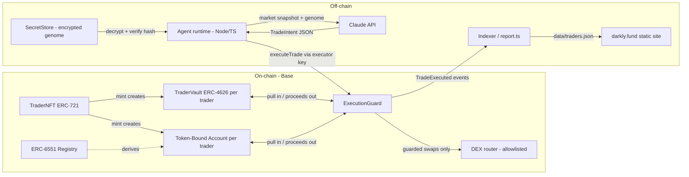

# Brokners — Technical Architecture

*Companion to [whitepaper.md](whitepaper.md). Describes the prototype in this
repository and, where they differ, the production design. Testnet/local only.*

## 1. System overview



The design principle: **the runtime is untrusted; the contract is the trust boundary.**
Everything the AI can do on-chain is bounded by `ExecutionGuard` policy.

## 2. Contracts

All contracts live in `protocol/src/`. Custom code is deliberately thin over audited
building blocks: OpenZeppelin v5 (`ERC721`, `ERC4626`, `SafeERC20`, `ReentrancyGuard`)
and the tokenbound `erc6551/reference` registry + account (vendored, never rewritten).

### 2.1 TraderNFT.sol (ERC-721)

Per-token storage:

```solidity
struct Genome {
    bytes32 commitment;        // keccak256 of canonical genome JSON — immutable
    uint64  birthBlock;
    uint8   riskProfile;       // 0 conservative / 1 balanced / 2 aggressive
    uint8   cadence;           // declared max trades per day (informational trait)
    string  model;             // pinned model identifier
    string  encryptedPromptCID;// pointer to the encrypted genome blob
}
```

- `mint(bytes32 commitment, uint8 riskProfile, uint8 cadence, string model, string cid)`
  — stores the genome record, deploys the token's TBA via the 6551 registry, deploys
  the token's `TraderVault` clone, registers default guard policy, emits `TraderBorn`.
- `MAX_SUPPLY = 4096` — the collection is hard-capped ("one brain per bit"); mint
  reverts once `nextId` reaches it.
- `genomeOf(id)`, `accountOf(id)` (TBA address), `vaultOf(id)` — getters.
- `_update()` override — checkpoints the vault's fee accrual before every transfer, so
  accrued-but-unminted fees are crystallized under the seller's watch.
- **No genome mutation path exists.** Immutability = provenance.

### 2.2 ExecutionGuard.sol (singleton, keyed by tokenId)

The only contract the executor key can usefully call. Per-trader policy:

| Field | Meaning |
|---|---|
| `executor` | the runtime's hot key; rotatable by token owner |
| `venueAllowlist` | routers the trader may touch (⊆ curated set) |
| `tokenAllowlist` | the trader's asset universe (⊆ curated set) |
| `maxNotionalBps` | per-trade cap as bps of NAV |
| `maxSlippageBps` | tolerance of `minAmountOut` vs. quote |
| `minTradeInterval` | on-chain cadence rate limit |

**Protocol curation (anti-wash-trading).** `curatedVenue` / `curatedToken` maps are
deployer-level. `initPolicy` (at mint) requires the venue and the whole universe to be
curated; owners' `setVenueAllowed`/`setTokenAllowed` can disallow freely but can only
*allow* curated entries. Launch scope is deliberately tiny: one venue, two markets
(WETH/USDC, WBTC/USDC).

**Seat tiers.** `tiers[3]` (Intern 20% / Associate 30% / Partner 50% notional
ceilings; deployer-tunable via `setTier`) bound each trader's `maxNotionalBps`.
`activate(tokenId, tier)` is owner-only, upgrade-only, and pulls the tier's one-time
fee in the base asset to the protocol `treasury`; `setPolicy` clamps to the seat's
ceiling. Everyone mints as an Intern.

**Paper season.** The guard counts `tradeCountOf[tokenId]` and stamps
`firstTradeAt[tokenId]`. `seasoned(tokenId)` is true once the trader has made
`seasonMinTrades` trades and `seasonDuration` has elapsed since its first trade — both
immutable constructor parameters. `TraderVault._deposit` requires `seasoned`, so a new
trader must trade its **own book** (`fromVault = false`, funded through its TBA) before
any outside deposit clears.

`executeTrade(tokenId, venue, tokenIn, tokenOut, amountIn, minAmountOut, fromVault)`:

1. `require(msg.sender == executor[tokenId])`
2. venue + both tokens allowlisted; interval elapsed
3. `amountIn <= maxNotionalBps × NAV / 10_000`
4. `minAmountOut >= quote × (10_000 − maxSlippageBps) / 10_000`
5. pull `amountIn` from the vault (or TBA), swap at `venue`, require
   `received >= minAmountOut`, **return all proceeds to the source of funds**
6. emit `TradeExecuted(tokenId, venue, tokenIn, tokenOut, amountIn, amountOut)`

There is no code path that sends assets to an arbitrary address. This invariant is
fuzz-tested (`Guardrails.t.sol`).

`setPolicy(...)` / `setExecutor(...)` — only `traderNFT.ownerOf(tokenId)`, read live,
so administrative control follows the token automatically on transfer.

### 2.3 TraderVault.sol (ERC-4626 clone per trader)

- Base asset: mock USDC (prototype). Standard `deposit/withdraw/mint/redeem`.
- `totalAssets()` = base balance + allowlisted-token balances valued via the execution
  venue's `quote()`. **Prototype-grade and manipulable** — production needs
  TWAP/Chainlink and stale-price circuit breakers (§7).
- Uses OZ's decimal-offset mitigation against the 4626 first-depositor inflation attack.
- `depositAllowlist` — ON by default; the accredited-gating compliance hook.
- Fees (`checkpoint()`, called on deposit/withdraw/NFT transfer):
  - management: `managementFeeBps` annualized, accrued pro-rata by elapsed time,
    minted as new shares (dilution).
  - performance: `performanceFeeBps` of the gain in assets-per-share above the
    per-share **high-water mark**; HWM ratchets up only.
  - fee shares are minted **to the trader's TBA** — accrued fees travel with the NFT,
    and there is no fee-sniping window around transfers.
  - `ringTheBell()` — the rewarded public crank: identical to `checkpoint()` except
    1% of the fee shares crystallized by that call mint to the caller instead of the
    TBA (`BELL_REWARD_BPS`). LP dilution is identical either way; the ringer's cut
    comes out of the owner's take.

### 2.4 Access-control matrix

| Action | Anyone | LP | Executor | Token owner |
|---|---|---|---|---|
| `deposit` (if allowlisted) / `withdraw` | | ✔ | | |
| `executeTrade` | | | ✔ | |
| `setExecutor`, `setPolicy` | | | | ✔ |
| sweep TBA (sell-without-capital) | | | | ✔ |
| `checkpoint()` | ✔ | | | |
| read genome, traits, history | ✔ | | | |

### 2.5 Mocks (prototype only)

`MockERC20` (open mint), `MockSwapRouter` (settable price, exact-in `swap()`,
`quote()` view, adjustable execution-vs-quote skew for negative slippage tests).
The guard is venue-agnostic. The first live target is Polymarket's conditional-token
exchange on Polygon (USDC collateral, binary outcome tokens as `tokenIn`/`tokenOut`),
reached through the same `IVenue` path, with the canonical 6551 registry
`0x000000006551c19487814612e58FE06813775758`. The open integration item is order
signing: Polymarket matches off-chain and settles on-chain, so the TBA has to sign
orders and the enclave has to apply the guard's policy to what it will sign.

## 3. Genome lifecycle

Custody is a public on-chain trait (`Genome.custody`): 0 authored, 1 sealed-authored,
2 sealed-generated. Sealed is the default recommendation.

```
authored (0):
  genome JSON ─canonicalize─▶ keccak256 ─▶ commitment    AES-256-GCM key kept by minter
  sale: key handoff (production: threshold encryption on ownerOf) — past owners retain plaintext

sealed (1, 2):
  [2 only] brief ─▶ prompt composed INSIDE the enclave (never displayed)
  genome ─canonicalize─▶ keccak256 ─▶ commitment
  genome ─ECIES(X25519 → HKDF → AES-256-GCM)─▶ sealed to the ENCLAVE public key
  run:  only the enclave private key can unseal; plaintext exists only inside the enclave
  sale: nothing to hand off — the sealed blob and the enclave stay put; exclusivity is total

every run: unseal/decrypt ─▶ recompute hash ─▶ MUST equal on-chain commitment, else refuse
```

- **Canonicalization is frozen**: UTF-8, sorted keys, no insignificant whitespace
  (`agent/src/genome.ts` is the reference implementation; the Solidity side only ever
  sees the 32-byte hash, so the format lives entirely off-chain but must never change).
- Implementation: `agent/src/enclave.ts` (seal/unseal, keygen),
  `agent/src/tools/make-genome.ts` (`keygen | author | seal | generate`),
  `SealedSecretStore` / `LocalSecretStore` behind one `SecretStore` interface.
- **The prototype's trust gap, stated plainly**: the "enclave" is the agent process
  and its private key is an env var — the operator can read sealed genomes. Production
  moves the keypair and the model call into a hardware TEE (e.g. AWS Nitro) whose
  attestation proves the runtime never exposes plaintext.
- Authored mode retains the disclosed limitation: past owners who decrypted keep the
  plaintext; sale transfers future exclusivity, not amnesia. That is exactly why the
  custody trait exists and why sealed modes are preferred.

## 4. Agent runtime

Node 20 + TypeScript, `viem` + `@anthropic-ai/sdk` + `zod`. Loop
(`agent/src/index.ts`):

```
load config → SecretStore.decrypt(genome) → verify hash vs on-chain commitment
  → snapshot market (balances, quotes, recent trades)
  → brain: Claude API, system prompt = genome, forced tool schema:
      TradeIntent { action: "swap" | "hold", tokenIn, tokenOut, amountIn, rationale }
  → policy.ts: local mirror of on-chain checks (fail fast, better errors)
  → executor.ts: compute minAmountOut from quote × slippage bound;
      simulate, then send executeTrade with the executor key
  → log receipt + TradeExecuted event → sleep(cadence) │ --once │ --dry-run
```

- `MockBrain` returns canned intents for deterministic demos and CI (no API key
  needed).
- The executor private key is a **burner**: bounded blast radius by construction. The
  owner key never touches the runtime.
- `report.ts` scans `TradeExecuted`/`Deposit` events and writes `data/traders.json`
  for the static site — the site renders, never computes.

## 5. Transfer flows

| Flow | Steps | Result |
|---|---|---|
| Sell WITH capital | `safeTransferFrom` | TBA (capital + accrued fee shares) and vault admin rights follow atomically; fee accrual checkpointed in the transfer hook |
| Sell WITHOUT capital | owner sweeps TBA → `safeTransferFrom` | buyer gets identity + genome rights + intact track record, empty book |
| Post-purchase hygiene | buyer calls `setExecutor(new)` | seller's runtime key is dead; buyer should also review token approvals left on the TBA |

## 6. Deployment topology

| Environment | Registry | Venue | Purpose |
|---|---|---|---|
| anvil (local) | deployed by `Deploy.s.sol` | `MockSwapRouter` | tests + demo (primary target) |
| Polygon Amoy | canonical `0x…5758` | Polymarket adapter vs. mock CTF exchange | public testnet pilot |
| Polygon mainnet | canonical `0x…5758` | Polymarket CTF Exchange | limited run, agent-owned capital only; gated on audit |

## 7. Threat model

| Threat | Prototype answer | Production answer |
|---|---|---|
| Runtime compromise | executor key can only trade within policy | same + TEE attestation |
| Genome theft by operator | sealed custody; enclave key in env (trust gap disclosed) | TEE holds the key; attestation |
| Genome leak via sale | sealed custody: nothing to hand off | same |
| NAV manipulation via venue price | mock venue; documented as unsafe | TWAP/Chainlink + crystallization delay |
| 4626 inflation attack | OZ decimal offset | same |
| MEV / front-running | tight `minAmountOut` | private order flow |
| Wash-traded track record | protocol-curated venues/tokens (owner cannot add own pools) + paper season before outside deposits | + leaderboard footnoting, volume-quality weighting |
| Instant-flip of fresh mints | paper season: min own-book trades + duration before vault opens | same, longer parameters |
| Stale executor after sale | buyer checklist: rotate key | consider auto-reset of executor on transfer |
| NFT deposited into own TBA (ownership cycle) | blocked: TBA cannot receive its own collection | same |
| Human puppeteering the "AI" (impersonation) | disclosed: AI-traded is an operator claim | TEE-attested executor keys + attestation registry ("Proof of Brain") |
| Fee sniping around transfer | fees accrue to TBA + checkpoint in transfer hook | same |

## 8. Open questions

- Fee defaults (2/20?) and whether protocol sets outer bounds on owner-set policy.
- Multi-asset vault accounting beyond a 2-token universe.
- LP protections when the NFT changes hands (withdrawal window? executor-change
  timelock with notice?). Prototype: none; v2 recommendation: timelocked executor
  change.
- Genome rotation on sale (privacy) vs. hash immutability (provenance) — currently
  resolved in favor of provenance.
- On-chain cadence enforcement (current: yes, `minTradeInterval`) vs. leaving cadence
  as an informational trait only.
